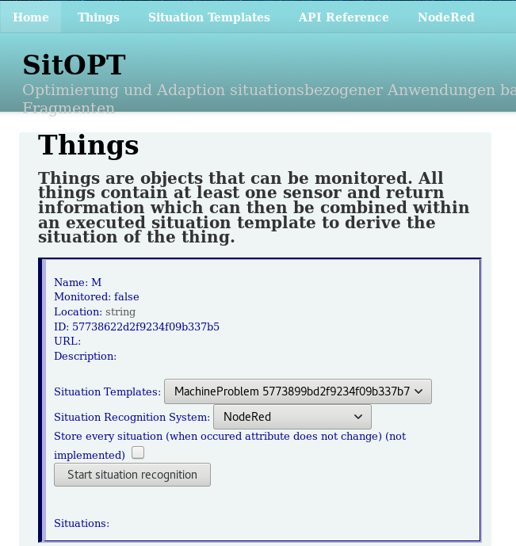
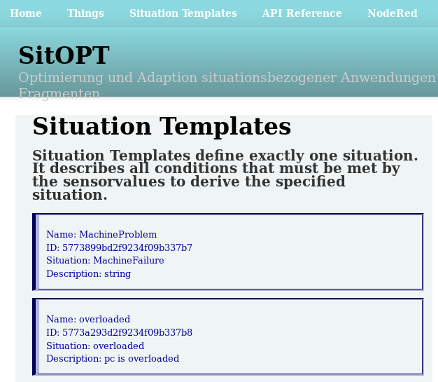

# Situation Dashboard

The Situation Dashboard displays general information about the things already added to SitOPT.
You can also start the Situation Recognition with this module.

## Things

A ``Thing`` is everything that exists in your situations.
Every sensor is attached to a ``Thing``.

The ``Things``-Tab lists all ``Things`` in your database.
You can also start the recognition of a situation on a thing in this tab.

### Starting recognition

 - Choose the Thing
 - Choose the Situation Template
 - Choose the Recognition Framework (esper/node-red)
 - Press ``Start situation recognition``

## Situation Templates

A ``Situation Template`` describes how a situation is derived, for example comparing a sensorvalue to a constant.

This tab shows you all ``Situation Templates`` that were added.

## Adding Things and Templates

To add ``Things`` and ``Situation Templates`` please refer to [Model Management](ModelManagement.md)