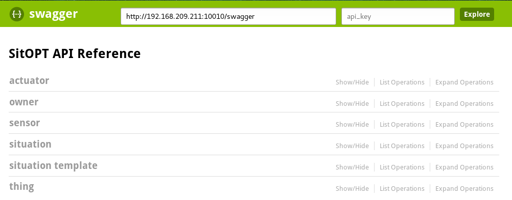

# Model Management

The Model Management module maintains the data SitOPT handles.
This data consists of:

 - Things
 - Situation Templates
 - Actuators
 - Sensors
 - Situations
 - Owners

## Data types

### Things

Things are everything that can be monitored with sensors.

### Owners

Owners own Things.

### Sensors

Sensors belong to Things. A sensor could be the temperature sensor of your printing press, while the press itself is a Thing.
Sensors are identified with the tuple ThingName and SensorName.

### Situations

A Situation describes that something happened to a thing. How a Situation is derived is described in a Situation Template

### Situation Templates

A Situation Template describes how the boolean value of a situation is calculated.

## API

You can see the API if you go to the dashboard, enter the tab ``API Reference`` and connect to http://$SERVER:10010/swagger.

