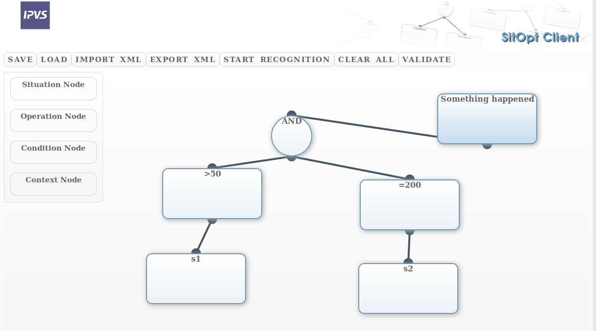

# Situation Modeling Tool

This module allows the creation of Situation Templates in XML format.

## Nodes

|Nodetype|Inputs|
|---|---|
|ContextNode|None|
|ConditionNode|One ContextNode|
|OperationNode|At least one OperationNode or ConditionNode|
|SituationNode|Exactly one OperationNode or ConditionNode|

## ContextNode

This Node describes the Sensor that should be read. 
The identifier of the sensor is derived by using the name of the node as SensorName and 
the later associated Thing's ThingName as ThingName.

## ConditionNode

Maps one ContextNode to a boolean value, for example through comparing it with a constant.

## OperationNode

Combines multiple ConditionNodes or OperationNodes into one boolean value, for example with NAND.

## SituationNode

The value that should be used as the final value of the situation.
The name of the node is the name of the situation later on.

## Connections

The connections signify the paths values travel.

## Example

This Situation is calculated the following way:

 - Get the value of s1
 - Check if value of s1 > 50
 - Get the value of s2
 - Check if value of s2 = 20
 - Combine the results of the two comparisons with the AND operator
 

