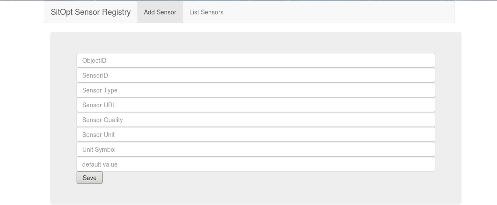
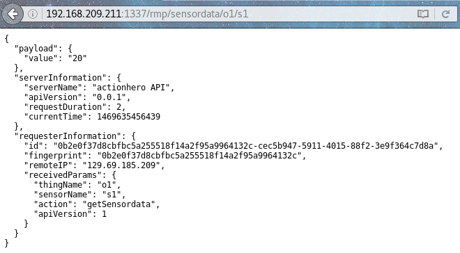

# Resource Management Platform

The Resource Management Platform (RMP) runs on port 1337.
After installing it, you can verify if it is running when you visit

> http://$SERVER:1337/

``$SERVER`` should be replaced with the URL or IP of the server, e.g. localhost.

The site should look like this:

## Adding a sensor

To add a sensor to the RMP, you have to enter the values of the sensor in the corresponding fields.

|Field         |Meaning                                                   |
|---|---|
|ObjectID      |The name thing that is associated with the sensor         |
|SensorID      |The name of the sensor                                    |
|SensorType    |The type of the sensor, like light sensor                 |
|Sensor URL    |The URL of the sensor. Only important for watchdog sensors|
|Sensor Quality|The quality of how precise the sensor is                  |
|Sensor Unit   |The unit of the sensor, like meters                       |
|Unit Symbol   |The symbol the unit uses, like m                          |
|default value |Value that is returned until a new real value is obtained |

## Endpoints

Path elements preceded by ``:`` are variable names

|Method|Path|Description|
|---|---|---|
|GET|/rmp/sensordata/:thingName/:sensorName|returns the value of the sensor|
|POST|/value|sets the value of the sensor specified in the body|
|GET|/sensor|returns a list of all sensors|
|GET|/sensor/:thingName/:sensorName|returns the specified sensor|
|POST|/sensor|creates a new sensor|
|PUT|/sensor/:thingName/:sensorName|Updates the specified sensor|
|DELETE|/sensor/:thingName/:sensorName|Deletes the specified sensor|

### Examples

## POST/PUT Parameter Bodies

### POST /value

|Field|Meaning|Required|
|---|---|---|
|sensorName|Name of the sensor|yes|
|thingName| Name of the thing|yes|
|value|The new value of the sensor|yes|
|timeStamp|The timestamp of the reading|no|
|quality|The quality of the sensor value|yes|

#### Example

~~~~
{
  "sensorName": "sensor1",
  "thingName": "thing1",
  "value": "200",
  "quality": 95
}
~~~~

### POST /sensor

|Field|Meaning|Required|
|---|---|---|
|sensorName|Name of the sensor|yes|
|objectName|Name of the thing|yes|
|sensorUrl|URL, the sensor is located at|yes|
|sensorType|Type of the sensor, eg. temperature sensor|yes|
|timeStamp|Timestamp, when the sensor was added|no|
|quality|The quality of the sensor|yes|
|unit|The name of the unit, the sensor measures, eg. meters|yes|
|unitSymbol|The symbol the unit uses, eg. m|yes|
|defaultValue|Value of the sensor until a new value comes|no|

~~~~
{
  "sensorName": "sensor1",
  "objectName": "thing1",
  "sensorUrl": "1.3.3.7",
  "sensorType": "Temperature",
  "quality": 70,
  "unit": "Degree Celcius",
  "unitSymbol": "°C"
}
~~~~

### PUT /sensor/:thingName/:sensorName

|Field|Meaning|Required|
|---|---|---|
|sensorUrl|URL, the sensor is located at|no|
|sensorType|Type of the sensor, eg. temperature sensor|no|
|timeStamp|Timestamp, when the sensor was updated|no|
|quality|Quality of the sensor|no|
|unit|The name of the unit, the sensor measures, eg. meters|no|
|unitSymbol|The symbol the unit uses, eg. m|no|
|defaultValue|Value of the sensor until a new value comes|no|

#### Example

~~~~
{
  "defaultValue": "10"
}
~~~~
